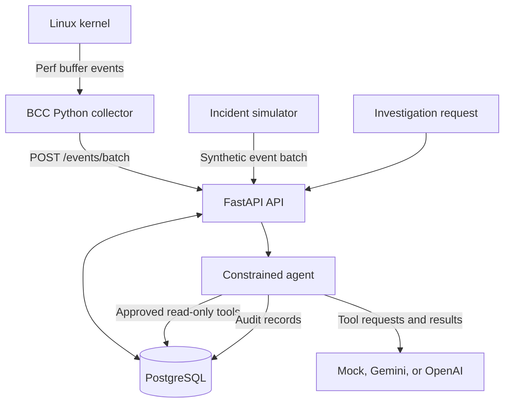

# TracePilot

> TracePilot is an eBPF-powered network incident copilot that captures per-process TCP activity and uses auditable AI tool calls to produce evidence-backed investigation reports.

TracePilot observes outbound TCP connection attempts on Linux, records them through a FastAPI and PostgreSQL backend, detects understandable network anomalies, and lets a constrained AI agent investigate questions such as:

> Why did PID 4242 suddenly open more than 100 outbound connections?

Unlike a general-purpose chatbot, the agent can access only a small set of read-only investigation tools. Every tool execution is recorded, and evidence-backed findings must cite event IDs returned by those tools.

## Features

- Captures outbound IPv4 and IPv6 TCP connections using BCC/eBPF
- Records PID, process name, UID, destination, timestamp, and connect latency
- Supports individual and batched event ingestion
- Detects connection bursts, unusual destinations, and high destination diversity
- Provides constrained, read-only AI investigation tools
- Supports mock, Gemini, and OpenAI LLM providers
- Logs every agent tool call for auditing
- Rejects reports containing invented event citations
- Includes a complete Docker-based simulator
- Includes automated API, database, agent, anomaly, and parser tests

## Architecture



The real collector runs directly on Linux because eBPF requires access to the host kernel. FastAPI, PostgreSQL, and the simulator run in Docker.

## Anomaly rules

TracePilot deliberately uses understandable rules instead of opaque machine learning:

1. A process opens more than a configured number of connections within one minute.
2. A process contacts an IP-and-port pair absent from its preceding baseline period.
3. A process contacts an unusually high number of unique destinations.

The AI agent investigates and explains these detections; it does not create them.

## Safe agent design

The agent can call only these tools:

- `get_process_connections`
- `get_top_network_processes`
- `find_connection_bursts`
- `find_unusual_destinations`
- `get_event_timeline`

It has no arbitrary shell, filesystem, or SQL access.

TracePilot validates tool arguments with Pydantic, records successful and rejected calls in `agent_tool_calls`, and requires citations in this format:

```text
[event:550e8400-e29b-41d4-a716-446655440000]
```

Before returning a report, the backend verifies that cited IDs were actually returned by an executed tool.

## Quick start: demo mode

### Requirements

- Docker
- Docker Compose

Clone the repository and enter the project directory:

```bash
git clone https://github.com/x0Shayan0x/TracePilot
cd TracePilot
```

Create the local environment file:

```bash
cp .env.example .env
```

For a completely free, deterministic demo, use:

```env
LLM_PROVIDER=mock
```

Start the complete demo:

```bash
docker compose up --build
```

The simulator waits for the API and then inserts a baseline plus a burst of synthetic connections for:

```text
PID 4242
Process python3
```

Open the interactive API documentation:

```text
http://localhost:8000/docs
```

## Run an investigation

Submit a question:

```bash
curl -X POST http://localhost:8000/investigations \
  -H "Content-Type: application/json" \
  -d '{
    "question": "Why did PID 4242 suddenly open so many outbound connections?"
  }'
```

The response contains an investigation UUID. Retrieve it with:

```bash
curl http://localhost:8000/investigations/<INVESTIGATION_ID>
```

Inspect the complete tool-call audit trail:

```bash
curl http://localhost:8000/investigations/<INVESTIGATION_ID>/tool-calls
```

To generate the simulated incident again:

```bash
docker compose run --rm simulator
```

## Gemini provider

Create a Gemini API key and configure `.env`:

```env
LLM_PROVIDER=gemini
GEMINI_API_KEY=your_key
GEMINI_MODEL=gemini-2.5-flash
```

Recreate the API container:

```bash
docker compose up -d --build --force-recreate api
```

Never commit `.env` or real API keys.

## Real eBPF collector

The collector must run directly on a Linux host or Linux VM with:

- BCC and its Python bindings
- Matching Linux kernel headers
- Root privileges

Start the Docker services:

```bash
docker compose up -d db api
```

Run the collector on the Linux host:

```bash
sudo python3 collector/collector.py \
  --api http://localhost:8000
```

Generate an outbound connection from another terminal:

```bash
curl https://example.com
```

The collector batches captured events and sends them to:

```text
POST /events/batch
```

Connections created by the collector itself and destinations using TracePilot’s API or PostgreSQL ports are filtered to avoid feedback loops.

## API endpoints

| Method | Endpoint | Purpose |
|---|---|---|
| `GET` | `/health` | Check API health |
| `GET` | `/health/database` | Check PostgreSQL connectivity |
| `POST` | `/events` | Insert one connection event |
| `POST` | `/events/batch` | Insert a batch of events |
| `GET` | `/processes/{pid}/connections` | Retrieve a process’s connections |
| `GET` | `/analytics/top-processes` | Rank processes by connection count |
| `GET` | `/analytics/connection-bursts` | Detect one-minute connection bursts |
| `GET` | `/analytics/unusual-destinations` | Find destinations absent from baseline |
| `GET` | `/analytics/high-unique-destinations` | Detect high destination diversity |
| `POST` | `/investigations` | Run an evidence-backed investigation |
| `GET` | `/investigations/{id}` | Retrieve an investigation |
| `GET` | `/investigations/{id}/tool-calls` | Retrieve its agent audit trail |

## Database model

TracePilot uses three primary PostgreSQL tables:

- `connection_events` stores captured or simulated telemetry.
- `investigations` stores questions, status, reports, and timestamps.
- `agent_tool_calls` stores every agent tool invocation, its validated arguments, and its result.

## Testing

Create the isolated test database once:

```bash
docker compose exec db \
  createdb -U tracepilot tracepilot_test
```

Build the API test image:

```bash
docker compose build api
```

Run the complete backend and collector test suite:

```bash
docker compose run --rm \
  -e TEST_DATABASE_URL=postgresql+asyncpg://tracepilot:tracepilot@db:5432/tracepilot_test \
  -v "$PWD/collector:/app/collector:ro" \
  api python -m pytest -v tests collector/tests
```

The test suite covers:

- FastAPI ingestion and query endpoints
- PostgreSQL persistence
- Burst and anomaly-detection rules
- IPv4 and IPv6 eBPF event parsing
- Agent tool allowlisting
- Tool argument validation
- Successful and rejected audit records
- Mocked provider responses
- Fabricated event-citation rejection
- Investigation success and failure states

CI runs the same tests with PostgreSQL using GitHub Actions. It uses the deterministic mock provider and does not require an API key, BCC, or eBPF privileges.

## Project structure

```text
TracePilot/
├── backend/
│   ├── app/
│   │   ├── llm/
│   │   ├── agent.py
│   │   ├── agent_tools.py
│   │   ├── database.py
│   │   ├── main.py
│   │   ├── models.py
│   │   └── schemas.py
│   ├── tests/
│   └── Dockerfile
├── collector/
│   ├── collector.py
│   ├── event_parser.py
│   └── tests/
├── simulator/
├── .github/workflows/tests.yml
├── docker-compose.yml
└── README.md
```

## Current limitations

- The recorded duration represents time spent completing the kernel `connect` operation, not the full lifetime of the TCP connection.
- The BCC collector depends on kernel symbols and compatible kernel headers.
- The baseline anomaly rule is process-specific but intentionally simple.
- An event-ID validator can detect fabricated citations, but it cannot fully determine the truth of unrestricted natural-language statements.
- Authentication and multi-user separation are outside the initial prototype’s scope.

## Future improvements

- Track TCP close events to calculate complete connection lifetimes
- Add configurable detection policies
- Add retention and pagination for high event volumes
- Add authentication and tenant isolation
- Enrich destinations with optional DNS or ownership information
- Package a libbpf/CO-RE collector for easier deployment
- Add a small investigation dashboard
